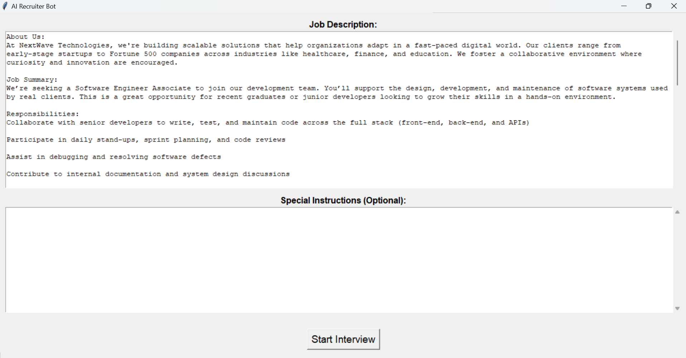
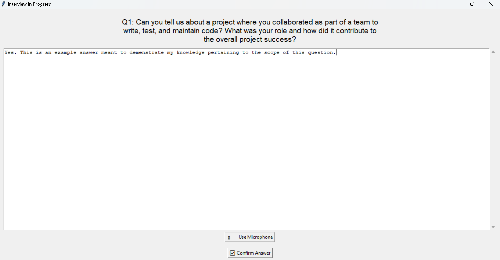
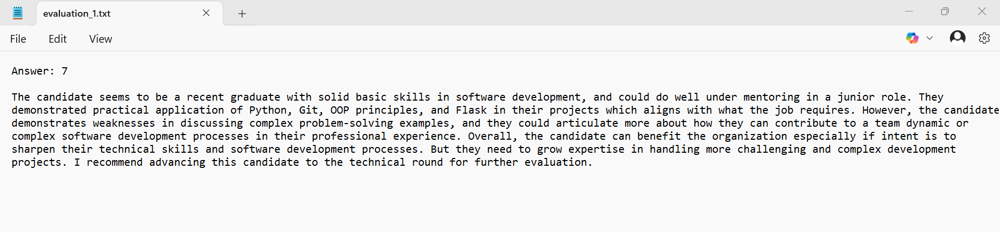

# Recruiter - AI-Powered Interview Screener 🧠🎙️

This is an interactive AI-powered tool that simulates HR interviews. Built with OpenAI GPT-4, this app automatically generates tailored interview questions based on a job description and evaluates candidate responses.

> ⚠️ **Note:** This repository is for showcase purposes only. The source code is not publicly available to protect intellectual property.

## 🔍 What It Does

- Accepts a job description and optional recruiter preferences
- Uses GPT-4 to generate smart, context-aware interview questions
- Opens an interview window for the candidate to:
  - Hear each question via voice
  - Respond via microphone or typing
- Automatically evaluates the responses using GPT
- Outputs a scored interview evaluation in `.txt` format

## 🖼️ Screenshots

### Setup Page

### Interview Page

### Evaluation Output

## 🔒 Source Code Access

To request access to the full source code or discuss licensing, please reach out via [LinkedIn](https://www.linkedin.com/in/eddie-steiner-940aba301/).

---

© 2025 Eddie Steiner. All rights reserved.
